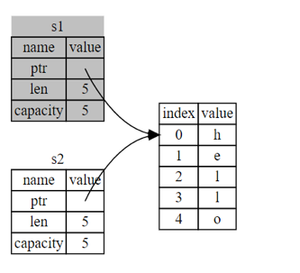

# Rust Notes

## Table of Contents
1. [Cargo](#1-cargo)
2. [Running a Program - Detailed](#2-running-a-program---detailed)
3. [Rust Basics](#3-rust-language-basics)
    * [Data Types](#data-types)
    * [Variables](#variables)
    * [References](#references)
    * [Shadowing](#shadowing)
    * [Scope](#scope)
    * [Statements & Expressions](#statements--expressions)
    * [Functions](#functions)
    * [Returning from Function](#returning-from-function)
    * [If Expressions](#if-expressions)
    * [Loops](#loops)
    * [Comments](#comments)
4. [Ownership](#4-ownership)
    * [Ownership Rules](#ownership-behaviors)
    * [References, Pointers, and Borrowing](#references-and-pointers)
    * [Moving Variables](#moving-variables)
    * [Copying Variables](#stack-data---copy)
    * [Dangling References](#dangling-references)
    * [Stack and Heap](#side-note-stack-and-heap)
5. [Structs](#5-structs)
    * 

Official Docs: https://doc.rust-lang.org/book/ch01-03-hello-cargo.html

## 1. Cargo

Cargo is Rusts build system and package manager.

A rust project will have the following files:
* src/
  * main.rs
* Cargo.toml
* .gitignore
* .git

Create a project in new directory: `cargo new project_name` \
Create a project in existing directory: `cargo init`

**Cargo.toml** is the config file for your project and looks like this:

```toml
[package]  # SECTION HEADING
name = "rust_learning"
version = "0.1.0"
edition = "2021"

# See more keys and their definitions at https://doc.rust-lang.org/cargo/reference/manifest.html

[dependencies]  # PACKAGE DEPENDENCIES - KNOWN AS CRATES
```


### File Structure
Cargo expects your code to live in the src folder. 
The top-level project directory should only be used for README files, licenses, config files, 
and other things not directly related to your code.

### Create and Run w/ Cargo:
1. Create a rust project
```
cargo new project_name
cd project_name
```
2. Update **main.rs** files in src folder. This the source code of your project.
3. Compile and run `cargo run`
4. To build non-debug file `cargo build --release`

<hr>

[Bank To Top](#table-of-contents)
## 2. Running a Program - Detailed

##### Build Process
When your project was created with cargo, compile the project with: `cargo build`. 
The default build made is debug, so cargo puts your file .exe file into the following directory
`./target/debug/<filename>.exe`

But this is not very efficient.  Instead of compiling and running in two steps, we can do both with: `cargo run`

##### Compile Check
You can also check if your code will compile, but not creating an .exe file, by running: `cargo check`

##### Build Profiles, Dev and Release
When your project is finally ready for release, you can use `cargo build --release` to compile it with optimizations. 
This command will create an executable in `target/release` instead of `target/debug`. 
The optimizations make your Rust code run faster, but turning them on lengthens the time it takes for your 
program to compile. This is why there are two different profiles: 
1. Development, when you want to rebuild quickly and often
2. Building the final program you’ll give to a user that won’t be rebuilt repeatedly and that will run as fast as possible. 

##### Benchmarking
If you’re benchmarking your code’s execution time, be sure to run `cargo build --release` and benchmark with the executable in `target/release`.

##### Cargo.lock
Running cargo build for the first time also causes Cargo to create a new file at the top level: Cargo.lock. This file keeps track of the exact versions of dependencies in your project. This project doesn’t have dependencies, so the file is a bit sparse. You won’t ever need to change this file manually; Cargo manages its contents for you.

From <https://doc.rust-lang.org/book/ch01-03-hello-cargo.html?search=> 

### Running with `rustc`

`rustc` is the basic rust compiler.  It is not recommended to use this for building projects, 
but it is useful for testing code.

`rustc filename.rs` will create the .exe file.  
You can then run the `./filename.exe` file, or you can run a command in the terminal. 
On Windows, when the file is compiled, there is a .pdb file created which is debugging information.  

<hr>

[Bank To Top](#table-of-contents) 
## 3. Rust Language Basics

#### Data Types
Rust is a statically typed language, which means that it must know the types of all variables at compile time.

* Scalar Types - single value types
    * Integers
      * Signed (has a negative and positive)
      * i8, i16, i32, i64, i128, isize
    * Unsigned (only positive)
        * u8, u16, u32, u64, u128, usize
    * Floating-Point Numbers 
      * f32, f64 with f64 being the default. Always signed.
    * Booleans
      * bool (true, false)
    * Characters
      * char (single quotes)
      ```rust
        fn main() {
            let c = 'z';
            let z: char = 'ℤ'; // with explicit type annotation
            let heart_eyed_cat = '😻';
        }
        ```

* Compound Types - grouped values
  * Tuples
    * Fixed length, non-mutable, can contain different types.
    * Parenthesis `let tup = (500, 6.4, 1);`
    * Can destructure a tuple: `let (x, y, z) = tup;`
    * Can access a tuple by index:
    ```rust
    fn main() {
        let x = (500, 6.4, 1);
        let five_hundred = x.0;
        let six_point_four = x.1;
        let one = x.2;
        }
    ```
  * Arrays
    * Fixed length, non-mutable, must contain same type.
    * Square brackets `let a = [1, 2, 3, 4, 5];`
    * Can access an array by index: `let first = a[0];`
    * Arrays are useful when you want your data allocated on the stack rather than the heap. or when you want to ensure you always have a fixed number of elements
    * An array isn’t as flexible as the vector type, though. A vector is a similar collection type provided by the standard library that is allowed to grow or shrink in size. If you’re unsure whether to use an array or a vector, chances are you should use a vector.


#### Variables
Variables are created by using the let keyword: `let x = 5;`
Variables are immutable by default.  To make a variable mutable, use the mut keyword: `let mut x = 5;`


#### References
Using a reference: `read_line(&mut x)`. The `&` before a variable name indicates that it’s a reference. 
This gives you a way to access one piece of data without needing to copy that data into memory multiple times. 
References are also immutable by default. 

#### Shadowing
Overwriting a variable instead of making a new one.

#### Scope
Scope is the area of code where a variable is valid.  This is usually expressed within curly braces:
```rust
fn main() {
    // Outer scope
    let outer_variable = 5; // x is valid from here until the end of the function
    {
        // Inner scope
        let inner_variable = 6; // y is valid from here until the end of the inner scope
        println!("inner_variable: {}", inner_variable);
        
        // You can access outer variables from inner scopes
        println!("outer_variable: {}", outer_variable);
    }
    
    // inner_variable is not valid here
    // we can still access outer_variable here
    println!("outer_variable: {}", outer_variable);
}
```

#### Statements & Expressions
* **Statements** are instructions that perform some action and do not return a value.
	* Functions
	* Setting variables
	* Loops
	* Note: statements in rust must end with a semicolon. 
* **Expressions** evaluate to a resultant value. Expressions do not end in semicolon.
	* 5
	* 10+6
	* Calling a function that returns
	* Calling a macro
	* If expressions
	* Note: expressions can be part of statements (let x = 6; 6 is an expression)
	* Note: expressions that are followed by a semicolon are treated as statements

#### Functions

```rust
fn main() {
    println!("Hello, world!");
}
```
Functions are a central design of rust. The main function will always be the first code to run.

#### Returning from Function
```rust
fn repeat_value(i: i32) -> i32 {
    i
}
```
To return a value from a function, you need to have the arrow and return type. 
The last [expression](#statements--expressions) will be what a function returns if it has a return type.
You can also return early with the return keyword
```rust
fn repeat_value(i: i32) -> i32 {
    if i > 5 {
        return i+5;
    }
    i
}
```

If a function will not return anything you can exclude the arrow and return type.
```rust
fn just_print(i: i32) {
    println!("i: {}", i);
}
```

#### If Expressions

Standard if expressions, pretty similar to python.  Be sure to put the contents in the curly braces.
```rust
fn if_control(i: i32) -> i32 {
    if i > 5 {
        i+5
    } else if x < 0 {
        i-5
    }
    else {
        i
    }
}
```

If statements can also be used on the right side of a variable. 
This is because if statements evaluate to a value and are actually called **[if expressions](#statements--expressions)**

```rust
fn main() {
    let condition = true;
    let number = if condition {
        5
    } else {
        6
    };
    println!("The value of number is: {}", number);
}
```

#### Loops
There are 3 kinds of loops:
1. Loop
   1. Infinite loop - continuously execute something until a condition is met and then either use the continue or break keyword.
   ```rust
   fn main() {
       loop {
           println!("again!");
       }
   ```
    You can return values from a loop by using break.
    ```rust
    fn main() {
        let mut counter = 0;
        let result = loop {
            counter += 1;
            if counter == 10 {
                break counter * 2;
            }
        };
        println!("The result is {}", result);
    }
    ```

   **Loop labels** help with control flow of multiple loops. The default for break is to break the inner most loop. You can
   use loop labels to break out of higher loops within inner loops
    ```rust
    fn main() {
        let mut count = 0;
        let remaining = 10;
        'outer_loop: loop {
            println!("Count = {}", count);
            loop {
                count += 1;
                println!("Loop {} of {}", count, remaining);
                if count == remaining {
                    break;
                } else if count == 100 {
                    break 'outer_loop;
                }
            }
        }
        println!("End of program");
    }
    ```
   
2. While - Good for looping until a condition is met.
    ```rust
    fn main() {
        let mut number = 3;
        while number != 0 {
            println!("{}!", number);
            number -= 1;
        }
        println!("LIFTOFF!!!");
    }
    ```
    
3. For - Good for looping through a collection
    ```rust
    fn main() {
        let a = [10, 20, 30, 40, 50];
        for element in a.iter() {
            println!("the value is: {}", element);
        }
    }
    ```

### Comments 
`//` just like javascript


<hr>

[Bank To Top](#table-of-contents)
## 4. Ownership
Three rules of ownership:
1. Each value in Rust has a variable that’s called its owner.
2. There can only be one owner at a time.
3. When the owner goes out of scope, the value will be dropped.

Ownership is Rust’s most unique feature, and it enables Rust to make memory safety guarantees without needing a garbage collector.

#### Ownership Behaviors
* Ownership can be moved or copied.  
  * If data is on the stack, it will be copied.  If on the heap, it will be moved.
  * Copying is cheap, moving is expensive.
* If a variable goes out of scope, it gets dropped automatically which frees up the memory.
* When passing a variable into a function, ownership of the variable goes to the function.  
* If the variable is not on the stack, it will not exist outside of that function it was passed into, unless it returns a value.
```rust
fn main() {
    let s = String::from("hello");  // s comes into scope

    takes_ownership(s);             // s's value moves into the function...
                                    // ... and so is no longer valid here

    let x = 5;                      // x comes into scope

    makes_copy(x);                  // x would move into the function,
                                    // but i32 is Copy, so it’s okay to still
                                    // use x afterward
    }
```

#### References and Pointers
There are two types of pointers in rust:
1. References
2. Raw pointers

A reference is like a pointer in that its an address we can follow to access the data stored at that address, without taking ownership of the variable.

References are a safe way to access memory and are used by the `&` character:
    
```rust
let x = 42;
let y = &x;  // y is a reference to x

println!("The value of x is {}", x);
println!("The value of y is {}", y);
```

Raw pointers have no safety guarantees and are used by the `*`
```rust
let x = 42;
let y = &x as *const i32;  // y is a raw pointer to x

unsafe {
    println!("The value of x is {}", *y);  // this will print the value of x
}
```

References are created by using the `&`, creating a reference is called **borrowing**. Borrowing allows you to pass a variable into a function without taking ownership of it.

```rust
fn main(){
    let s1 = String::from("hello");
    let len = calculate_length(&s1);
    println!("The length of '{}' is {}.", s1, len);
}

fn calculate_length(s: &String) -> usize {
    s.len()
}
```

Just as when you borrow something from a person, you have to give it back the same way you received it.  This means you can't modify it when borrowing AKA REFERENCES ARE IMMUTABLE BY DEFAULT, JUST LIKE VARIABLES

To make a reference mutable looks very similar to variables:
```rust
fn main(){
    let mut s = String::from("hello");
    change(&mut s);
}

fn change(some_string: &mut String) {
    some_string.push_str(", world");
}
```

NOTE: If you have a mutable reference to a value, there can be no other simultaneous references to that value.  This prevents issues with data races.

Note that a reference’s scope starts from where it is introduced and continues through the last time that reference is used. For instance, this code will compile because the last usage of the immutable references, the println!, occurs before the mutable reference is introduced:
    
```rust
fn main() {
    let mut s = String::from("hello");

    let r1 = &s; // no problem
    let r2 = &s; // no problem
    println!("{} and {}", r1, r2);
    // r1 and r2 are no longer used after this point

    let r3 = &mut s; // no problem
    println!("{}", r3);
}
```

The example above is ok because by the time r3 (the mutable referece) is created, the immutable references are out of scope.  They drop after their final usage.


#### Moving Variables

When setting a variable equal to a new variable, Rust invalidates the first variable. 
This is to prevent double free errors which are when the ownership model tries to drop one of the variables but not the other that is also referencing the same memory.


s1 becomes invalid when s2 is assigned to s1.  This is because s1 and s2 are both pointing to the same memory address.  When s2 is assigned to s1, s1 is no longer valid because it is no longer the only owner of the memory address.

#### Stack Data - Copy
Data that is stored on the stack is so efficient that its not a problem to manage.  As a convience, Rust is not afraid to duplicate data that’s stored on the stack.  In other words, references on the stack that point to data on the heap need much more management which is why there are more rules and limiations to follow. Like moving variables,

For stack data, there's no differences between shallow and deep copys because of something called the copy trait.  Variables that hold data with types that have the copy trait, are copied instead of moved so they are still valid after the copy.

Here are some of the types that implement Copy:
* All the integer types, such as u32.
* The Boolean type, bool, with values true and false.
* All the floating-point types, such as f64.
* The character type, char.
* Tuples, if they only contain types that also implement Copy. For example, (i32, i32) implements Copy, but (i32, String) does no

**How does this work with functions?**

Ownership is passed through functions using this same concept of ownership.  If the variable is a type that has the copy trait, the variable is still valid after its passed. Otherwise ownership is passed into the function and then no goes out of scope once the function ends.

```rust
fn main() {
    let s = String::from("hello");  // s comes into scope
    
    takes_ownership(s);             // s's value moves into the function...
                                    // ... and so is no longer valid here
    
    let x = 5;                      // x comes into scope
    
    makes_copy(x);                  // x would move into the function,
                                    // but i32 is Copy, so it’s okay to still
                                    // use x afterward
    }

fn takes_ownership(some_string: String) { // some_string comes into scope
    println!("{}", some_string);
} // Here, some_string goes out of scope and `drop` is called. The backing
  // memory is freed.

fn makes_copy(some_integer: i32) { // some_integer comes into scope
    println!("{}", some_integer);
} // Here, some_integer goes out of scope. Nothing special happens.

```

But what if you want a function to use a value but not take ownership of it.  Its annoying to have to constantly return the variable to use it again.

#### Dangling References

Dangling references are when a variable is created and a reference to that variable created, and the variable goes out of scope but the program tries to keep the reference alive.  

```rust
fn dangle() -> &String { // dangle returns a reference to a String
    let s = String::from("hello"); // s is a new String

    &s // we return a reference to the String, s
} // Here, s goes out of scope, and is dropped. Its memory goes away.
  // Danger!
```
The variable `s` will go out of scope at the end of the function above but its trying to return the reference, which will reference something that no longer exits.  DANGER!  Rust will throw an error to catch these.

## Side Note: Stack and Heap

About memory allocation

* Data is stored in either the stack or the heap when in memory.
* The stack is more organized and quicker.  This holds data where the length is known and fixed. 
* The heap is a less organized, less efficeint data store.  This holds data where the length is not known at runtime or might change.  This is because the program has to find a space for the memory but a stack just goes right on top every single time. 
* Data that is on the stack is directly related.  So `let x = 6;` is actually connected to 6.  Data on the heap creates a pointer that points to the address of the data on the heap.  To access a piece of memory on the heap, you need to follow a pointer.  This means the program is bouncing around the memory to find what its looking for, instead of using the data that’s right next to it already. 
* Data on the stack can be copied but data on the heap can only be referenced (pointed).  Sort of like shallow copy and deep copy.

If you want to "deepcopy" data on the heap, you need to call the method clone.  But keep in mind this is expensive.

```rust
let s1 = String::from("hello");
let s2 = s1.clone();

println!("s1 = {}, s2 = {}", s1, s2);
```

But to "deep copy" data on the stack, its as simple as creating another variable
```rust
fn main() {
    let x = 5;
    let y = x;

    println!("x = {}, y = {}", x, y);
}
```
Data on the stack is very efficient so this is fine.  

[Bank To Top](#table-of-contents)
## 5. Structs
[Docs](https://doc.rust-lang.org/book/ch05-00-structs.html)


